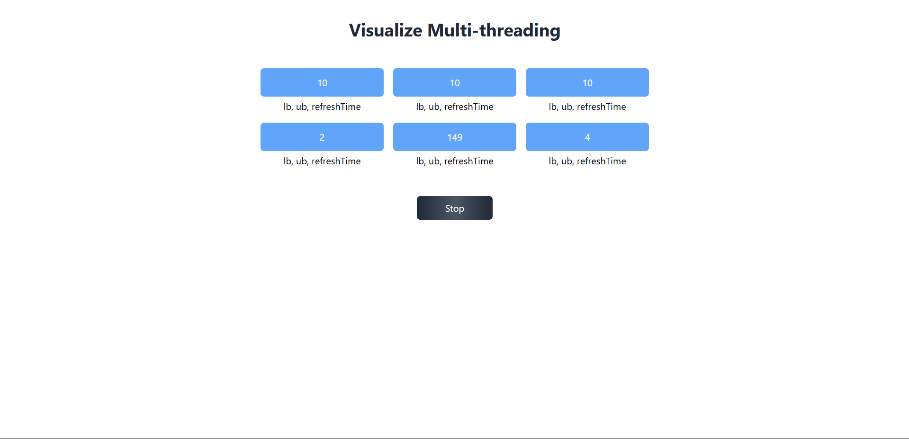

# Basic Multi-Threading Visualization

## Overview
This project demonstrates multi-threading in Python by creating multiple threads that perform specific tasks like generating random numbers within defined bounds and refreshing at specified intervals. The GUI displays the output in an organized and interactive way.



## Features
- **Multi-threaded execution:** Six independent threads run simultaneously to simulate different tasks.
- **Dynamic random number generation:** Each thread generates numbers within specific bounds and refreshes at unique intervals.
- **Interactive GUI:** Visual representation of threads with the ability to stop execution.

## Requirements
To run this project, you need to have the following installed:
- Python 3.7+
- Libraries listed in `requirements.txt`.

## Installation
1. Clone the repository:
    ```bash
    git clone <repository_url>
    cd <repository_folder>
    ```
2. Install dependencies:
    ```bash
    pip install -r requirements.txt
    ```

## Usage
1. Run the script:
    ```bash
    python visualize_multithreading.py
    ```
2. Watch as multiple threads generate random numbers in real time.
3. Press the "Stop" button in the GUI to terminate all threads.

## Code Description
### `task` Function
The `task` function generates random numbers between a lower bound (`lb`) and an upper bound (`ub`) at specified intervals (`refreshTime`). The output is displayed in real-time.

### Multi-Threading
The script creates six threads, each configured with its own:
- Lower and upper bounds for random number generation.
- Refresh interval for displaying new random numbers.

### GUI
The graphical interface includes:
- Thread activity visualization.
- A "Stop" button to terminate all threads.

## Example Threads
1. **Thread 1**: Generates numbers between `10` and `20`, refreshing every `10` seconds.
2. **Thread 2**: Generates numbers between `-10` and `10`, refreshing every `20` seconds.
3. **Thread 3**: Generates numbers between `-100` and `0`, refreshing every `8` seconds.
4. **Thread 4**: Generates numbers between `0` and `20`, refreshing every `12` seconds.
5. **Thread 5**: Generates numbers between `-40` and `40`, refreshing every `16` seconds.
6. **Thread 6**: Generates numbers between `100` and `200`, refreshing every `14` seconds.


## Future Improvements
- Add user input for bounds and refresh times.
- Enhance the GUI to display real-time data dynamically.
- Include performance metrics for threads.

